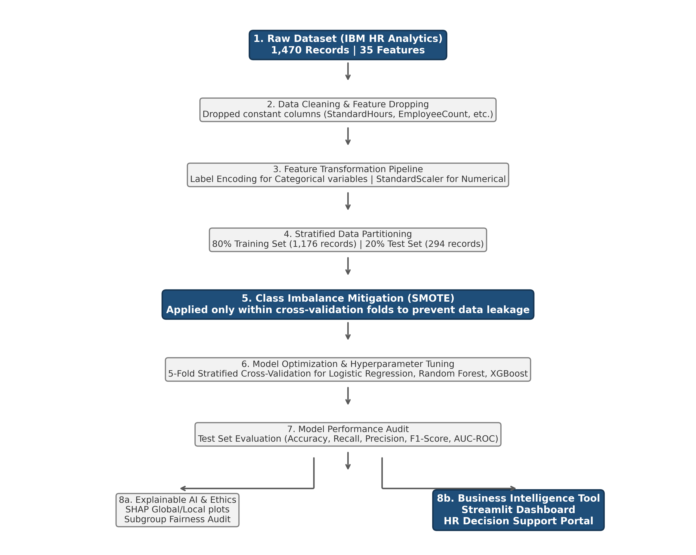

# 👔 Predicting Employee Attrition Using Machine Learning 🚀



## 📌 Project Overview
This repository contains an end-to-end Machine Learning pipeline designed to predict employee attrition using the **IBM HR Analytics dataset**. Developed as part of the **7005SCN Individual Research Project (MSc Data Science, Coventry University)**, this project tackles class imbalance, model interpretability, and algorithmic fairness to provide actionable insights for data-driven HR strategy.

---

## 🎯 Key Features & Workflow

* **📊 Exploratory Data Analysis (EDA):** Visualized turnover dynamics across demographic, operational, and financial features (e.g., `OverTime`, `MonthlyIncome`, `TotalWorkingYears`).
* **⚖️ Imbalance Handling:** Implemented **SMOTE** and hybrid resampling strategies to correct severe target class imbalance.
* **🤖 Model Benchmarking:** Trained and evaluated **Logistic Regression**, **Random Forest**, and **XGBoost** using Precision, Recall, F1-Score, and ROC-AUC.
* **🔍 Explainable AI (XAI):** Applied **SHAP (SHapley Additive exPlanations)** values (beeswarm & bar plots) for feature importance transparency.
* **⚖️ Algorithmic Fairness:** Evaluated model performance across demographic sub-groups to ensure unbiased predictions.

---

## 📁 Repository Structure

```text
.
├── 📂 Code & Report/
│   ├── 📓 7005SCN_CW2_Attrition_Project.ipynb   # Primary Jupyter Notebook (EDA, ML, SHAP, Fairness)
│   └── 📄 7005SCN_CW2_Project_Report.docx       # Full Academic Research Report
│
├── 📂 Figures/
│   ├── 🛠️ pipeline_flowchart.png                # ML Pipeline Architecture
│   ├── 📈 fig1_attrition_distribution.png        # Target Class Distribution
│   ├── 📊 fig2_attrition_by_category.png         # Categorical Feature Breakdown
│   ├── 📉 fig3_numerical_distributions.png      # Numerical Feature Histograms
│   ├── 🗺️ fig4_correlation_heatmap.png          # Correlation Analysis
│   ├── ⚖️ fig5_smote_effect.png                 # SMOTE Resampling Impact
│   ├── 🔄 fig5b_resampling_comparison.png      # Resampling Methods Benchmarking
│   ├── 📊 fig6_model_comparison.png             # Overall Model Performance Comparison
│   ├── 🎯 fig6b_recall_improvement_comparison.png # Recall Gain Evaluation
│   ├── 🧩 fig7_confusion_matrices.png           # Standard Model Confusion Matrices
│   ├── 🧩 fig7b_hybrid_confusion_matrices.png    # Hybrid Model Confusion Matrices
│   ├── 📈 fig8_roc_curves.png                   # ROC-AUC Curves
│   ├── 🐝 fig9_shap_beeswarm.png                # SHAP Summary Beeswarm Plot
│   ├── 📊 fig10_shap_bar.png                    # SHAP Feature Importance Bar Plot
│   └── ⚖️ fig11_fairness.png                    # Algorithmic Fairness Audit
│
├── 📜 .gitignore                                # Excluded files specification
└── 📖 README.md                                 # Project Documentation
```

---

## 🗃️ Dataset Information

* **Source:** IBM AI Fairness 360 Repository
* **Dataset Link:** [IBM Employee Attrition CSV](https://raw.githubusercontent.com/IBM/employee-attrition-aif360/master/data/emp_attrition.csv)
* **Scope:** 1,470 employee records with 35 operational and demographic attributes.

---

## ⚡ Quick Start & Installation

### 1️⃣ Clone the Repository
```bash
git clone https://github.com/AbhiThumar/IBM-Employee-attrition-prediction.git
cd IBM-Employee-attrition-prediction
```

### 2️⃣ Install Required Packages
```bash
pip install pandas numpy scikit-learn imbalanced-learn xgboost shap matplotlib seaborn
```

### 3️⃣ Launch Jupyter Notebook
```bash
jupyter notebook "Code & Report/7005SCN_CW2_Attrition_Project.ipynb"
```

---

## 🏆 Key Findings & Results Summary
* **💡 Recall Optimization:** Resampling significantly improved minority class (churners) recall, minimizing costly false negatives.
* **🔑 Primary Attrition Drivers:** SHAP analysis pinpointed `OverTime`, `StockOptionLevel`, `MonthlyIncome`, and `Age` as critical predictors.
* **🛡️ Equitable Predictions:** Fairness audits verified consistent predictive accuracy across demographic subgroups.

---

## 📄 License
Distributed under the **MIT License**. See `LICENSE` for details.
